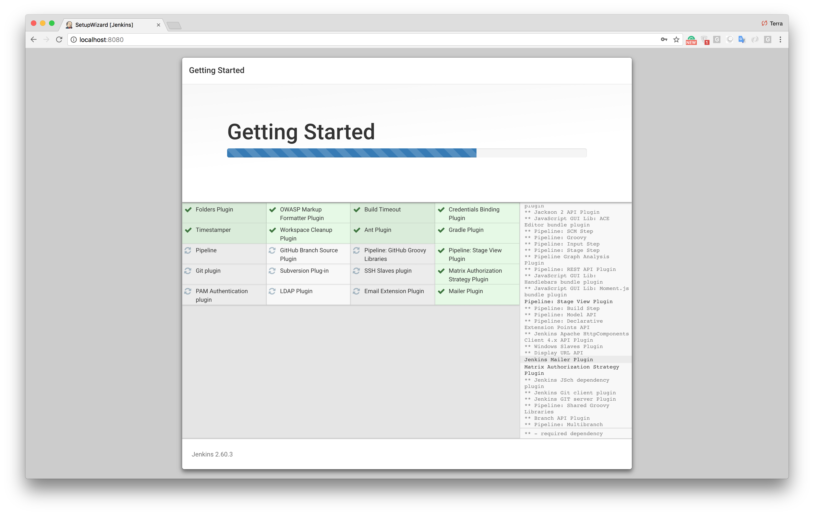

# A tutorial about secure fast (and furious) Continuous Integration and Continuous Delivery by Dockerize Jenkins Pipeline

This repository is a tutorial it tries to exemplify how to include security controls before/after each step of CI/CD pipline.

The [ticketmagpie](https://github.com/TmmmmmR/ticketmagpie/) is used as an example with a configured "Security Gate" to check the security level of the n

Original DevOps pipeline (without security controls) : https://github.com/hakdogan/jenkins-pipeline


## First step, running up the services

``Docker compose`` can be used to run services working together. Each compent of the pipeline was configured in a yaml file as below.

``docker-compose.yml``
```yml
version: '3.2'

networks:
  workshop_lab:
    driver: bridge

services:

  sonarqube:
    image: sonarqube
    ports:
      - 9000:9000
      - 9092:9092
    container_name: sonarqube
    networks:
      - workshop_lab

  jenkins:
    build:
      context: jenkins/
    privileged: true
    user: root
    ports:
      - 8080:8080
      - 50000:50000
    container_name: jenkins
    volumes:
      - /home/jenkins/:/var/jenkins_home #Remember that, the tmp directory is designed to be wiped on system reboot.
      - /var/run/docker.sock:/var/run/docker.sock
    networks:
      - workshop_lab

  arachni:
    image: ahannigan/docker-arachni
    build: .
    ports:
      - "9292:9292"
      - "7331:7331"
    command: bin/arachni_rest_server --address 0.0.0.0
    container_name: arachni
    networks:
      - workshop_lab

  threadfix:
    image: jmbmxer/threadfix
    ports:
      - 8443:8443
    container_name: threadfix
    entrypoint: ./threadfix.sh start
    networks:
      - workshop_lab

  testvuln:
    image: dhatanian/ticketmagpie
    ports:
      - 8081:8080
    container_name: testvuln
    environment:
      - SPRING_PROFILES_ACTIVE=hsqldb
    networks:
      - workshop_lab

```

If we run the following command in the same directory as the ``docker-compose.yml`` file, containers will up and run.

```
docker-compose -f docker-compose.yml up --build
```


## Jenkins configuration

We have configured Jenkins in the docker compose file to run on port 8080 therefore if we visit http://localhost:8080 we will be greeted with a screen like this.


We need the admin password to proceed to installation. It’s stored in the ``/var/jenkins_home/secrets/initialAdminPassword`` directory and also It’s written as output on the console when Jenkins starts.

```
jenkins      | *************************************************************
jenkins      |
jenkins      | Jenkins initial setup is required. An admin user has been created and a password generated.
jenkins      | Please use the following password to proceed to installation:
jenkins      |
jenkins      | 45638c79cecd4f43962da2933980197e
jenkins      |
jenkins      | This may also be found at: /var/jenkins_home/secrets/initialAdminPassword
jenkins      |
jenkins      | *************************************************************
```

To access the password from the container.

```
docker exec -it jenkins sh
/ $ cat /var/jenkins_home/secrets/initialAdminPassword
```

After entering the password, we will download recommended plugins and define an ``admin user``.





After clicking **Save and Finish** and **Start using Jenkins** buttons, we should be seeing the Jenkins homepage. One of the seven goals listed above is that we must have the ability to build an image in the Jenkins being dockerized. Take a look at the volume definitions of the Jenkins service in the compose file.
```
- /var/run/docker.sock:/var/run/docker.sock
```

The purpose is to communicate between the ``Docker Daemon`` and the ``Docker Client``(_we will install it on Jenkins_) over the socket. Like the docker client, we also need ``Maven`` to compile the application. For the installation of these tools, we need to perform the ``Maven`` and ``Docker Client`` configurations under _Manage Jenkins -> Global Tool Configuration_ menu.


## Sonarqube configuration

For ``Sonarqube`` we have made the following definitions in the ``pom.xml`` file of the project.

```xml
<sonar.host.url>http://sonarqube:9000</sonar.host.url>
...
<dependencies>
...
    <dependency>
        <groupId>org.codehaus.mojo</groupId>
        <artifactId>sonar-maven-plugin</artifactId>
        <version>2.7.1</version>
        <type>maven-plugin</type>
    </dependency>
...
</dependencies>
```

In the docker compose file, we gave the name of the Sonarqube service which is ``sonarqube``, this is why in the ``pom.xml`` file, the sonar URL was defined as http://sonarqube:9000.

## Arachni configuration 

TBD

## Threadfix configuration 

TBD
